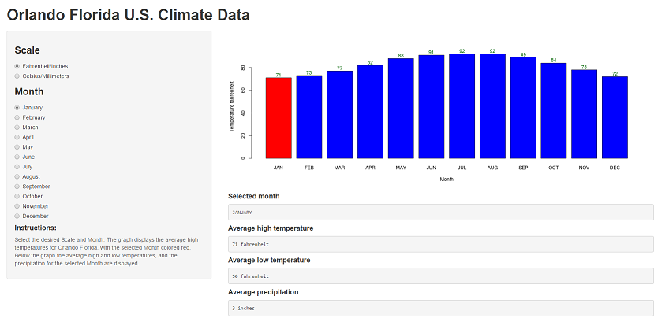

---
title       : Visit Orlando Florida U.S.
subtitle    : Climate Data
author      : A Shiny application developed by dboiani
job         : for Coursera's Developing Data Products class project
framework   : io2012        # {io2012, html5slides, shower, dzslides, ...}
highlighter : highlight.js  # {highlight.js, prettify, highlight}
hitheme     : tomorrow      # 
widgets     : []            # {mathjax, quiz, bootstrap}
mode        : selfcontained # {standalone, draft}
knit        : slidify::knit2slides
--- 

## Are you traveling to Orlando Florida?

* To visit Disney, Universal or another theme park?
* To attend the University of Central Florida?
* To the Kennedy Space Center to watch a rocket launch?

## Are you curious about the weather?

* How HOT does it get?
* How COLD does it get?
* How much does it RAIN?

## Then try out this simple, easy to use Shiny application...

--- .class #id

## Features

* Defaults to the current Month
      + Graph displays the selected Month colored red
* Select the temperature/precipitation scale: 
      + Fahrenheit/Inches or Celsius/Millimeters
* Select the Month you wish to travel


--- .class #id 

## server.r Conversions


```r
        # input monthly temperatures in Fahrenheit
        tempHigh <- c(71,73,77,82,88,91,92,92,89,84,78,72)
        # converted to Celcius
        round(((tempHigh-32)*5)/9, digits=1)
```

```
##  [1] 21.7 22.8 25.0 27.8 31.1 32.8 33.3 33.3 31.7 28.9 25.6 22.2
```


```r
        # input monthly precipitation in Inches
        precipitation <- c(2.76,2.83,3.78,2.48,3.31,8.74,7.09,7.83,6.02,3.31,2.4,2.64)
        # converted to Millimeters
        round(precipitation*25.4, digits=0)
```

```
##  [1]  70  72  96  63  84 222 180 199 153  84  61  67
```
# Source:
http://www.usclimatedata.com/climate/orlando/florida/united-states/usfl1021

--- .class #id 

## Use the application here:

https://dsdboiani.shinyapps.io/DevelopingDataProductsProject/
* Requires a newer browser 
* May take a few minutes to load




